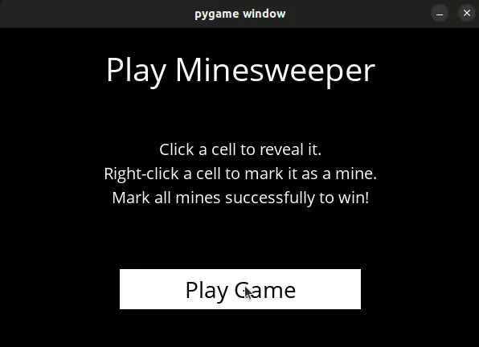

# Minesweeper 🎮

Welcome to Minesweeper, a classic game where your goal is to clear a grid of hidden mines without triggering them. This version features an **AI player** that uses **knowledge-based inferencing techniques** to play optimally, minimizing the risk of triggering a mine and maximizing the chances of winning!




## Project Structure

- **assets/**: Contains the assets for the UI and game visuals.
- **minesweeper.py**: The core logic and algorithm behind the Minesweeper game, including the AI implementation.
- **runner.py**: The main script to run the game. Execute this file to start playing the game or to watch the AI in action.
- **requirements.txt**: Lists the necessary Python libraries used by the project.

## Features

- **AI Player**: The AI plays the game optimally using knowledge-based inferencing techniques. It analyzes the board state and determines the best move with minimal risk of triggering a mine.
- **Interactive UI**: A user-friendly interface to play Minesweeper or watch the AI make its moves.
- **Grid Variations**: The game supports different grid sizes, from beginner to expert difficulty levels.
- **Randomized Mines**: Mines are placed randomly in each game, ensuring a unique experience every time you play.

## How It Works

The game is powered by a knowledge-based AI that uses inferencing techniques to decide the optimal moves. The AI considers the following:

1. **Probabilistic Reasoning**: The AI uses knowledge about the current board state (numbers and revealed squares) to calculate the likelihood of where mines might be located.
2. **Inference Rules**: The AI applies logic-based inference rules to deduce safe squares or potential mine locations.
3. **Optimal Play**: By using the knowledge base, the AI ensures that it plays the game in a way that maximizes safety and minimizes risk.

### How the AI Plays:
- The AI starts by uncovering areas where it is safe, based on its initial knowledge of the game and logic rules.
- It uses the numbers on the grid (which represent the number of surrounding mines) to infer the locations of hidden mines.
- It continuously applies inference rules to make the safest possible move at every step.

## Installation

1. **Clone the repository**:
   ```bash
   git clone https://github.com/afsal4/Minesweeper.git
   cd Minesweeper
   ```

2. **Install dependencies**:
    ```bash
    pip install -r requirements.txt
    ```

3. **To Run the game**:
    ```bash
    python runner.py
    ```


## How to Play

1. **Start the Game**: Run `python runner.py` in your terminal to launch the game.
2. **Play Manually**: Interact with the game by uncovering squares. Your goal is to avoid mines while uncovering all the safe spaces.
3. **AI Mode**: Let the AI play the game for you! Watch as it intelligently navigates the grid, applying its knowledge-based inferencing techniques to make optimal moves.

## Knowledge-Based AI Inferencing

The AI in this project uses **knowledge-based inferencing techniques** to play the game optimally. Here's how it works:

- **Knowledge Base**: The AI maintains a set of facts about the current game state. This includes information about uncovered squares, surrounding numbers, and the potential locations of mines.
- **Inference Mechanisms**: By applying logical rules, the AI deduces which squares are safe and which might contain mines. For example, if a square displays a number '1', and there's only one adjacent covered square, the AI can safely infer that the covered square contains a mine.
- **Optimal Decision Making**: The AI uses its knowledge to minimize risk by uncovering safe squares and avoiding dangerous ones. It continuously applies its inference rules to decide the best course of action.


---

Enjoy the challenge of Minesweeper or watch the AI in action as it makes optimal moves!
